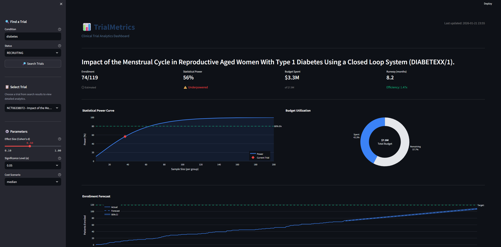

# 📊 TrialMetrics — Clinical Trial Analytics Dashboard

> **Track 1 — Tech Build** | 305 Hackathon — January 2026 Edition

A unified dashboard that combines real-time statistical power analysis, enrollment forecasting, and budget tracking for clinical trials — bringing portfolio management discipline to clinical research.



---

## 🎯 Theme Alignment: AI in Healthcare & Biotech

**Challenge:** *"Build a virtual research or clinical-trial dashboard for tracking metrics over time"*

**Our Solution:** TrialMetrics addresses a critical gap in clinical operations. Today, teams use Veeva/Medidata for enrollment, SAS/R for statistics, and spreadsheets for budgets. **No unified view exists** that combines:

1. ✅ Real-time statistical power analysis
2. ✅ Enrollment forecasting with confidence intervals  
3. ✅ Budget burn rate and runway tracking
4. ✅ AI-powered trial summaries

---

## 🔍 How We're Different

**Existing solutions** like Medidata CTFM focus on financial workflow management — budget negotiation, site payments, and contracting processes.

**TrialMetrics** provides unified *statistical* analytics:

| Capability | Medidata CTFM | TrialMetrics |
|------------|---------------|--------------|
| Power Analysis | ❌ | ✅ Non-central t-distribution |
| Enrollment Forecasting | ❌ (tracking only) | ✅ OLS with HAC-robust SE |
| Statistical Modeling | ❌ | ✅ Confidence intervals |
| Budget Analytics | Workflow-focused | Burn rate + efficiency metrics |
| AI Summaries | ❌ | ✅ GPT-powered insights |

We solve the **fragmentation problem**: teams currently juggle SAS/R for statistics, Veeva/Medidata for enrollment, and spreadsheets for budgets. TrialMetrics unifies these in one dashboard with rigorous statistical methods.

---

## 🚀 Features

### 📈 Statistical Power Analysis
- Two-sample t-test power calculations using non-central t-distribution
- Interactive power curves with 80% threshold visualization
- Required sample size calculations for target power

### 📊 Enrollment Forecasting
- OLS regression with HAC-robust standard errors (Newey-West)
- 95% confidence intervals for projected completion dates
- Visual timeline with actual vs. forecast comparison

### 💰 Budget Tracking
- Synthetic cost model based on industry benchmarks by phase
- Burn rate and runway calculations
- Efficiency ratio: enrollment progress vs. budget utilization

### 🤖 AI-Powered Summaries
- GPT-4.1-nano integration for executive briefings
- Risk-level assessment (🔴 High Risk / 🟡 Moderate / 🟢 On Track)
- Actionable recommendations

---

## 🛠️ Technology Stack

| Component | Technology |
|-----------|------------|
| Frontend | Streamlit 1.31.0 |
| Data Source | ClinicalTrials.gov API v2 |
| Statistical Analysis | SciPy, Statsmodels |
| Visualization | Plotly |
| AI Integration | OpenAI GPT-4.1-nano |
| Language | Python 3.11+ |

---

## 📦 Installation

### Prerequisites
- Python 3.11+ or Miniconda/Anaconda
- OpenAI API key (for AI summaries)

### Quick Start

```bash
# Clone the repository
git clone https://github.com/nathanramoscfa/trialmetrics.git
cd trialmetrics

# Create conda environment
conda create -n trialmetrics python=3.11 -y
conda activate trialmetrics

# Install dependencies
pip install -r requirements.txt

# Set up environment variables
# Create a .env file with:
# OPENAI_API_KEY=your-api-key-here

# Run the dashboard
streamlit run app.py
```

### Environment Variables

Create a `.env` file in the project root:

```
OPENAI_API_KEY=sk-your-openai-api-key
```

---

## 📁 Project Structure

```
trialmetrics/
├── app.py                      # Main Streamlit dashboard
├── requirements.txt            # Python dependencies
├── environment.yml             # Conda environment spec
├── .env                        # API keys (not in repo)
├── src/
│   ├── api/
│   │   └── clinical_trials.py  # ClinicalTrials.gov API wrapper
│   ├── analysis/
│   │   ├── power_analysis.py   # Statistical power calculations
│   │   ├── enrollment_forecast.py  # OLS regression forecasting
│   │   └── cost_model.py       # Budget tracking model
│   └── ai/
│       └── summarizer.py       # OpenAI integration
└── screenshots/                # Dashboard screenshots
```

---

## 📊 Data Sources

| Data Type | Source | Status |
|-----------|--------|--------|
| Trial Metadata | ClinicalTrials.gov API | ✅ Live |
| Enrollment Targets | ClinicalTrials.gov API | ✅ Live |
| Enrollment Time Series | Modeled | 📊 Projected |
| Budget Figures | Industry Benchmarks | 📊 Modeled |
| Statistical Calculations | Real-time | ✅ Calculated |

*Note: Historical enrollment data and actual costs are not publicly available. Production deployment would integrate with sponsor's clinical trial management systems (Veeva, Medidata, Oracle).*

---

## 🎬 Demo

📹 **Demo Video:** [Watch on YouTube](https://youtu.be/An5PCmHWlrY) | [Download MP4](trialmetrics_demo.mp4)

📊 **Presentation:** [Google Slides](https://docs.google.com/presentation/d/1cXv1IQv9UJOncSECvgN7fueSm_xk8a6bNE8uPPmP6uc/edit?usp=sharing)

---

## 👤 Team

**Nathan Ramos, CFA** — Solo Developer

- Senior Portfolio Manager & Quantitative Researcher
- 10+ years experience in systematic investment strategies
- CFA Charterholder
- Expert in statistical modeling, Python, and data visualization

**Skill Transfer:**
- Portfolio optimization → Trial resource optimization
- Financial risk models → Clinical trial risk assessment
- HAC-robust standard errors → Applied to enrollment time series

---

## 🏆 Hackathon Information

| Item | Details |
|------|---------|
| Event | 305 Hackathon — January 2026 Edition |
| Theme | AI in Healthcare & Biotech |
| Track | Track 1 — Tech Build |
| Deadline | January 24, 2026 @ 8:00 PM ET |

---

## 📜 License

MIT License — see [LICENSE](LICENSE) for details.

---

## 🙏 Acknowledgments

- [ClinicalTrials.gov](https://clinicaltrials.gov) for the public API
- [OpenAI](https://openai.com) for GPT-4.1-nano
- [Streamlit](https://streamlit.io) for the dashboard framework
- 305 Hackathon organizers

---

*Built with ❤️ for the 305 Hackathon — January 2026*
